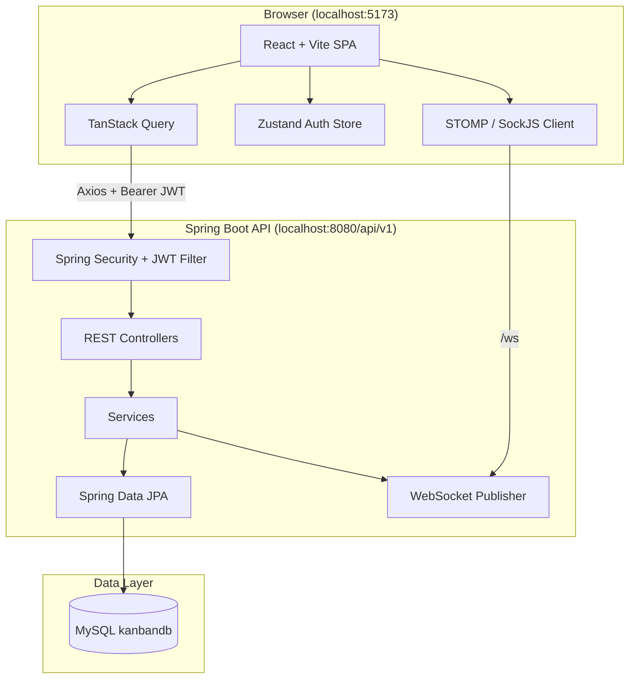
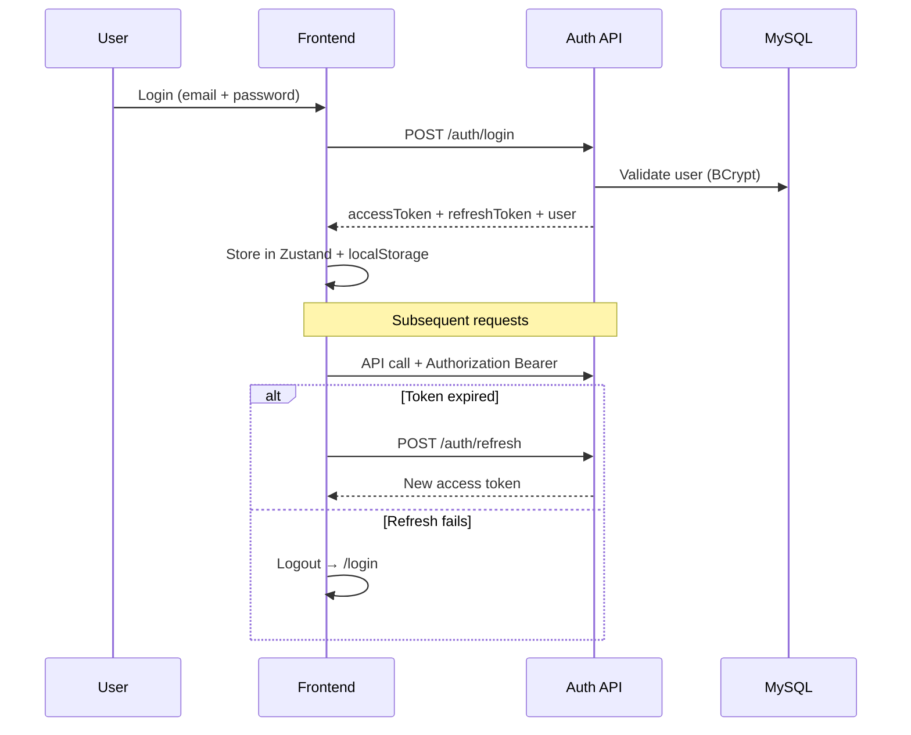
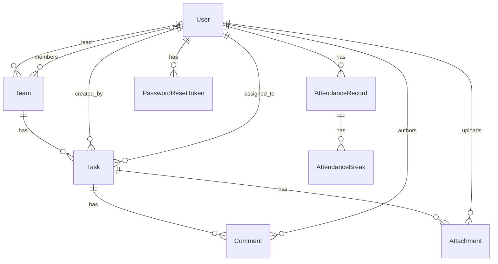

# Dinacharya Workspace

A full-stack team workspace for task management, people directory, attendance tracking, and moderation — built as a Kanban-style dashboard with real-time updates.

**Monorepo layout:** Spring Boot API at the repo root + React SPA in `frontend/`.

---

## Table of Contents

- [Features](#features)
- [Architecture](#architecture)
- [Tech Stack](#tech-stack)
- [Project Structure](#project-structure)
- [Application Flow](#application-flow)
- [User Roles & Routes](#user-roles--routes)
- [API Overview](#api-overview)
- [Database Model](#database-model)
- [Getting Started](#getting-started)
- [Environment Variables](#environment-variables)
- [Testing](#testing)
- [Production Notes](#production-notes)
- [Troubleshooting](#troubleshooting)

---

## Features

| Area | Capabilities |
|------|----------------|
| **Authentication** | Register, login, JWT access + refresh tokens, logout, forgot/reset password |
| **Teams** | Create teams, assign leads, add/remove members, delete teams, team settings |
| **Tasks / Kanban** | CRUD, drag-and-drop status columns, priorities, deadlines, assignee picker |
| **People** | User directory, enroll members, departments, employment & employee status |
| **Attendance** | Daily entry/exit, breaks, online/offline status, filters, export (moderator panel) |
| **Comments** | Threaded comments on tasks, flag/resolve for moderation |
| **Attachments** | Upload files on tasks (storage service placeholder) |
| **Analytics** | Per-team status breakdown and workload charts |
| **Moderation** | Flagged comments review, attendance admin, department management |
| **Real-time** | WebSocket (STOMP) for task, comment, and assignment events |
| **Email** | Task assignment, welcome/enroll, password reset (SMTP in dev) |
| **Audit** | Server-side audit log for task and user actions |

---

## Architecture



**Request path:** React pages → custom hooks (`useTasks`, `useTeams`, etc.) → Axios client (`frontend/src/api/client.ts`) → REST API → service layer → JPA repositories → MySQL.

**Real-time path:** Backend publishes events to STOMP topics after task/comment changes; frontend subscribes per team or user.

---

## Tech Stack

### Backend (`pom.xml`)

| Layer | Technology |
|-------|------------|
| Runtime | Java 17 |
| Framework | Spring Boot 3.2.4 |
| API | Spring Web REST |
| Persistence | Spring Data JPA, Hibernate |
| Database | **MySQL** |
| Security | Spring Security 6, JJWT |
| Mapping | MapStruct, Lombok |
| Real-time | Spring WebSocket, STOMP, SockJS |
| Email | Spring Mail |
| Docs | SpringDoc OpenAPI (Swagger UI) |
| Monitoring | Actuator, Micrometer Prometheus |
| Tests | JUnit 5, Spring Test, H2 (in-memory), Mockito |

### Frontend (`frontend/package.json`)

| Layer | Technology |
|-------|------------|
| UI | React 19, TypeScript |
| Build | Vite 8 |
| Styling | Tailwind CSS |
| Routing | React Router 7 |
| Server state | TanStack React Query |
| Client state | Zustand |
| HTTP | Axios |
| Forms | React Hook Form, Zod |
| Kanban DnD | @dnd-kit |
| WebSocket | @stomp/stompjs, sockjs-client |
| Charts | Recharts |

---

## Project Structure

```
Dashboard/
├── pom.xml                          # Maven backend
├── src/main/java/com/kanban/
│   ├── KanbanBackendApplication.java
│   ├── config/                      # Security, async
│   ├── controller/                  # REST endpoints
│   ├── service/                     # Business logic
│   ├── repository/                  # JPA repositories
│   ├── model/entity|dto|enums
│   ├── mapper/                      # MapStruct DTO mappers
│   ├── security/                    # JWT, permissions, password reset
│   ├── websocket/                   # STOMP config + event publisher
│   └── util/                        # Admin bootstrap, helpers
├── src/main/resources/
│   ├── application.yml                # Main config
│   ├── application-dev.yml          # Dev profile (mail, logging)
│   ├── application-prod.yml
│   ├── db/migration/                # V1–V7 SQL (reference; Flyway disabled)
│   └── templates/email/             # HTML email templates
├── src/test/                        # Unit + integration tests
├── frontend/
│   ├── src/
│   │   ├── api/client.ts            # Axios + JWT interceptors
│   │   ├── auth/roles.ts            # Admin vs employee routing
│   │   ├── components/              # Kanban, modals, layout, attendance
│   │   ├── hooks/                   # React Query hooks per resource
│   │   ├── pages/                   # Route pages
│   │   ├── store/authStore.ts       # Zustand + localStorage
│   │   ├── types/index.ts
│   │   └── App.tsx                  # Routes
│   ├── vite.config.ts               # Dev proxy → backend
│   └── package.json
├── .env.example
├── DESIGN.md                        # UI design tokens
└── README.md
```

---

## Application Flow

### 1. Authentication



- Access tokens default to **24 hours**; refresh tokens to **7 days**.
- On first startup, a default admin is created if missing: `admin@taskhub.com` / `admin` (see `AdminUserInitializer`).

### 2. Task workflow

1. **Admin/Moderator** creates a team → creator becomes **team lead**.
2. **Create task** on a team board (title, priority, deadline, assignee via people picker).
3. **Assign** task to a team member (assignee is auto-added to team if needed).
4. **Kanban drag-and-drop** or status patch moves: `TODO → IN_PROGRESS → IN_REVIEW → DONE`.
5. **Comments & attachments** on task detail modal.
6. **WebSocket** broadcasts changes to `/topic/teams/{teamId}`.
7. **Assignment notifications** sent to `/topic/users/{userId}`.

**Edit permissions:** task creator, team lead, moderator, or admin.

### 3. Employee vs admin experience

| Role | Home route | Primary UI |
|------|------------|------------|
| MEMBER, TEAM_LEAD | `/work` | Personal task dashboard |
| MODERATOR, ADMIN | `/tasks` | Full task management, teams, people, moderator panel |

Frontend routing is enforced in `App.tsx` via `AdminRoute` and `EmployeeRoute`.

### 4. Moderator / attendance flow

1. Moderator opens **Moderator Panel** (`/moderator`).
2. **Team Attendance** section: filter by date, department, status, search.
3. **Add member attendance** (existing user or create new member + department).
4. Record entry/exit times and breaks; status resolves to ONLINE / ON_BREAK / OFFLINE.
5. **Flagged comments** reviewed in the same panel.

---

## User Roles & Routes

### Roles (`UserRole`)

| Role | Capabilities |
|------|----------------|
| `MEMBER` | Team tasks, comments, attachments; employee `/work` view |
| `TEAM_LEAD` | Same as member in UI; can manage team members and team tasks on backend |
| `MODERATOR` | Admin UI + flag/resolve comments, attendance, departments |
| `ADMIN` | Full access including user management and team deletion |

### Frontend routes

| Path | Page | Access |
|------|------|--------|
| `/login`, `/register` | Auth | Public |
| `/forgot-password`, `/reset-password` | Password reset | Public |
| `/` | Redirect to `/tasks` or `/work` | Authenticated |
| `/work` | Employee dashboard | Member / Team lead |
| `/tasks` | Task management | Admin / Moderator |
| `/people` | Team people directory | Admin / Moderator |
| `/teams` | Teams overview | Admin / Moderator |
| `/teams/:teamId` | Kanban board | Admin / Moderator |
| `/teams/:teamId/settings` | Team settings | Admin / Moderator |
| `/teams/:teamId/analytics` | Charts | Admin / Moderator |
| `/profile` | User profile | All authenticated |
| `/moderator` | Attendance + flagged comments | Admin / Moderator |

---

## API Overview

**Base URL:** `http://localhost:8080/api/v1`

| Group | Base path | Notes |
|-------|-----------|-------|
| Auth | `/auth/*` | Register, login, refresh, logout, password reset |
| Users | `/users/*` | Profile, list, enroll, employment status |
| Teams | `/teams/*` | CRUD, members, analytics |
| Tasks | `/tasks/*` | CRUD, status, assign, overdue, my-tasks |
| Comments | `/tasks/{id}/comments`, `/comments/{id}` | List, create, delete |
| Attachments | `/tasks/{id}/attachments`, `/attachments/{id}` | Multipart upload |
| Moderator | `/moderator/*` | Flagged comments, attendance, departments, members |
| Mail | `/mail/*` | Status + test email (dev) |
| WebSocket | `/ws` | STOMP over SockJS |
| Docs | `/swagger-ui.html` | OpenAPI UI |
| Health | `/actuator/health` | Health check |

**WebSocket topics**

- `/topic/teams/{teamId}` — task, comment, attachment events
- `/topic/users/{userId}` — task assigned to user

Interactive API docs: [http://localhost:8080/api/v1/swagger-ui.html](http://localhost:8080/api/v1/swagger-ui.html)

---

## Database Model

Schema is managed by Hibernate (`ddl-auto: update`). SQL files under `src/main/resources/db/migration/` are reference only — **Flyway is disabled** at runtime.



**Main entities:** `User`, `Team`, `Task`, `Comment`, `Attachment`, `Department`, `AttendanceRecord`, `AttendanceBreak`, `PasswordResetToken`, `AuditLog`.

**Task statuses:** `TODO`, `IN_PROGRESS`, `IN_REVIEW`, `DONE`  
**Priorities:** `LOW`, `MEDIUM`, `HIGH`, `URGENT`  
**Attendance status:** `ONLINE`, `ON_BREAK`, `OFFLINE`

---

## Getting Started

### Prerequisites

- **Java 17+** and **Maven 3.8+**
- **Node.js 18+** and **npm**
- **MySQL 8+** (database `kanbandb`)

### 1. Database

Create the database (or let dev profile create it):

```sql
CREATE DATABASE IF NOT EXISTS kanbandb;
```

Default connection in `application.yml`:

- Host: `localhost:3306`
- Database: `kanbandb`
- User: `root`
- Password: `12345678` (change in config or env)

### 2. Backend

```bash
cd Dashboard

# Copy env template and set your local values (never commit `.env`)
cp .env.example .env

# Run with dev profile (recommended)
mvn spring-boot:run -Dspring-boot.run.profiles=dev
```

**IDE:** Open `Dashboard` as the Maven project root. Main class: `com.kanban.KanbanBackendApplication`.

**VS Code / Cursor:** Use launch config `Spring Boot-KanbanBackendApplication<kanban-backend>` (profile `dev`).

Backend starts on **http://localhost:8080** with context path `/api/v1`.

### 3. Frontend

```bash
cd frontend
cp .env.example .env
npm install
npm run dev
```

Frontend runs at **http://localhost:5173**. Vite proxies `/api` and `/ws` to the backend.

### 4. First login

Set `ADMIN_ENABLED=true` and `ADMIN_PASSWORD` in your local `.env` before first run to bootstrap an admin account. Defaults in `.env.example`:

| Setting | Example |
|---------|---------|
| `ADMIN_EMAIL` | `admin@taskhub.com` |
| `ADMIN_PASSWORD` | Your chosen dev password |

Or register a new account at `/register` (role: MEMBER).

**Never commit `.env` or real passwords to GitHub.** Change admin credentials after first login in production.

### Access URLs

| Service | URL |
|---------|-----|
| Frontend | http://localhost:5173 |
| API | http://localhost:8080/api/v1 |
| Swagger UI | http://localhost:8080/api/v1/swagger-ui.html |
| WebSocket | http://localhost:8080/api/v1/ws |
| Health | http://localhost:8080/api/v1/actuator/health |

---

## Environment Variables

### Backend (`.env` or system env)

| Variable | Description | Default |
|----------|-------------|---------|
| `DB_HOST` | MySQL host | `localhost` |
| `DB_PORT` | MySQL port | `3306` |
| `DB_NAME` | Database name | `kanbandb` |
| `DB_USERNAME` | MySQL user | `root` |
| `DB_PASSWORD` | MySQL password | — |
| `JWT_SECRET` | Signing key (use strong key in prod) | — |
| `JWT_EXPIRATION` | Access token TTL (ms) | `86400000` |
| `JWT_REFRESH_EXPIRATION` | Refresh token TTL (ms) | `604800000` |
| `SERVER_PORT` | HTTP port | `8080` |
| `SPRING_PROFILES_ACTIVE` | Active profile | `dev` |
| `MAIL_USERNAME` | SMTP user (dev email) | — |
| `MAIL_PASSWORD` | SMTP password / app password | — |
| `ADMIN_ENABLED` | Bootstrap default admin on startup | `false` (set `true` in dev `.env`) |
| `ADMIN_EMAIL` | Default admin email | `admin@taskhub.com` |
| `ADMIN_PASSWORD` | Default admin password | — (required if `ADMIN_ENABLED=true`) |

### Frontend (`frontend/.env`)

| Variable | Description | Default |
|----------|-------------|---------|
| `VITE_API_URL` | REST API base | `http://localhost:8080/api/v1` |
| `VITE_WS_URL` | WebSocket endpoint | `http://localhost:8080/api/v1/ws` |

---

## Testing

```bash
# Backend tests (uses in-memory H2 — no Docker required)
mvn test

# Frontend lint
cd frontend && npm run lint
```

Integration tests cover repository, service, and task workflow. Test profile: `src/test/resources/application-test.yml`.

---

## Production Notes

1. Set a strong `JWT_SECRET` (256+ bits).
2. Use managed MySQL; set `spring.profiles.active=prod`.
3. Configure SMTP for password reset and notifications.
4. Restrict CORS in `SecurityConfig` to your frontend origin.
5. Run behind HTTPS (reverse proxy or load balancer).
6. Change or remove the default admin account.
7. File uploads use a placeholder `FileStorageService` — wire Cloudinary or S3 before production use.

**Build artifacts:**

```bash
mvn clean package -DskipTests
java -jar target/kanban-backend-1.0.0.jar --spring.profiles.active=prod

cd frontend && npm run build   # output: frontend/dist
```

---

## Troubleshooting

| Issue | What to check |
|-------|----------------|
| **Build failed / no main class** | Open `Dashboard` folder as project root (not parent `Projects`). Main class: `com.kanban.KanbanBackendApplication`. Run `mvn clean compile`. |
| **Cannot connect to database** | MySQL running, `kanbandb` exists, credentials match `application.yml` or `.env`. |
| **401 on API calls** | Token expired — re-login; check `VITE_API_URL` matches backend context path. |
| **CORS errors** | Frontend origin must be `http://localhost:5173` or `http://localhost:3000` (see `SecurityConfig`). |
| **WebSocket not connecting** | Backend running; `VITE_WS_URL` correct; use SockJS URL not raw `ws://` in env. |
| **Email not sending** | Set `MAIL_USERNAME` / `MAIL_PASSWORD` in dev profile; `app.mail.enabled: true`. |
| **Tests fail with Docker error** | Tests use H2 in-memory DB; run `mvn test` from `Dashboard` root. |

---

## Related Docs

- `DESIGN.md` — UI color and typography tokens
- `frontend/README.md` — Frontend-specific notes
- `frontend/IMPLEMENTATION_COMPLETE.md` — Component build log

---

## License

Apache 2.0
